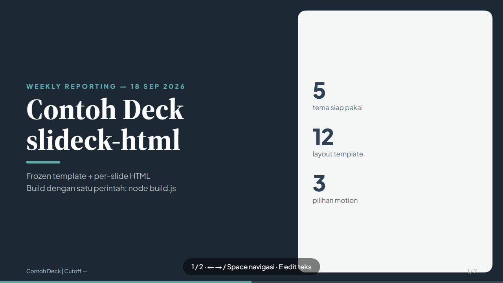
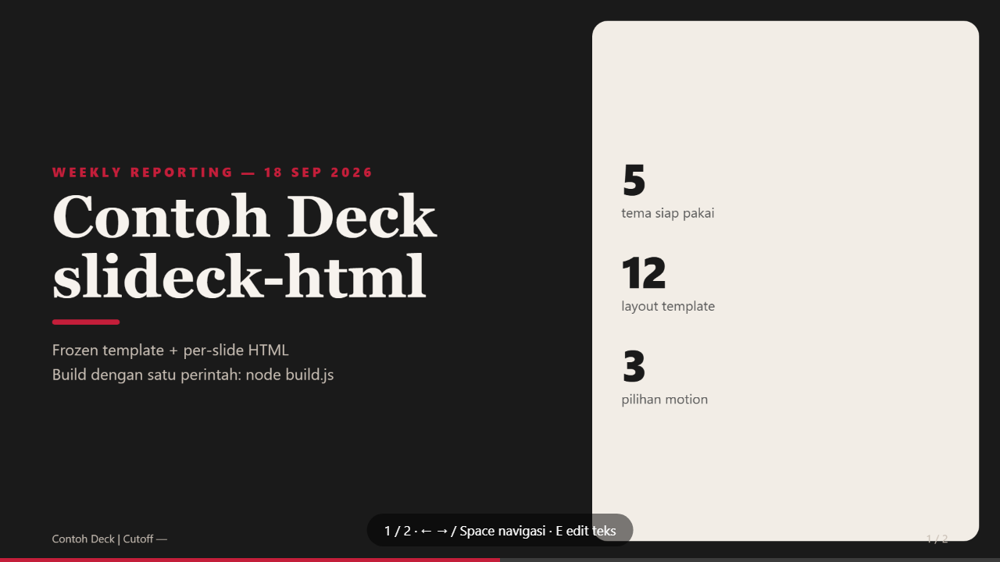
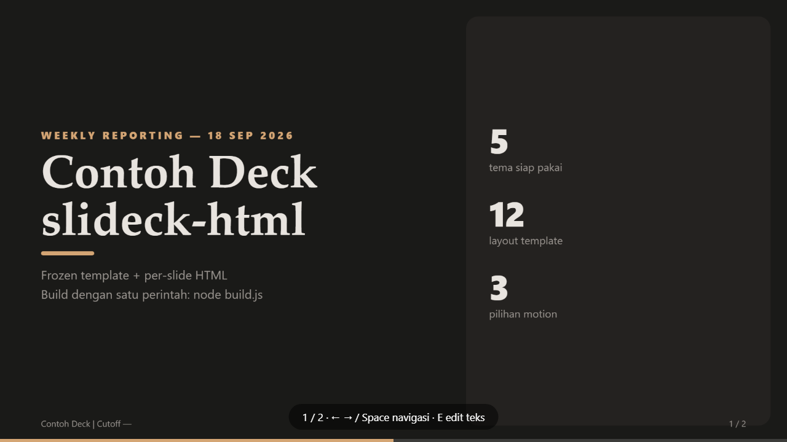
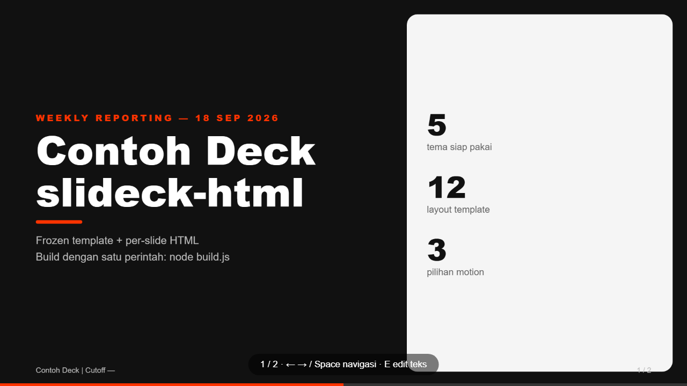
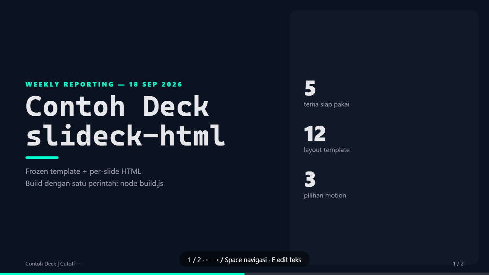

# slideck-html

Stable single-file HTML slide decks. Frozen template + per-slide files + `node build.js` (stdlib only, zero dependency).

Stage fixed **1920×1080**, scaled to viewport. Three dimensions separated: **theme** (color+font) × **layout** (12 templates) × **content** (`slides/`).

Output is one self-contained `.html` with fonts inlined base64 — works offline, opens by double-click, prints one slide per page.

## Preview

The same demo deck, same slides, five themes:

| navy (default) | paper | botanical |
|---|---|---|
|  |  |  |

| swiss | neon |
|---|---|
|  |  |

## For AI agents: read this first

If you were given this repo URL and asked to make slides, do exactly this:

1. **Read** `AGENTS.md` (rules), then `skill/SKILL.md` (workflow + themes + motions + templates).
2. **Never edit** `template.html`, `components.css`, `build.js`, `themes/`, `motions/`, `templates/`, `assets/`. Edit only `slides/*.html` + `deck.json`.
3. **New deck:** copy `templates/<n>-*.html` → `slides/NN-name.html`, replace `[...]` placeholders only, keep classes.
4. **Build:** `node build.js` → `dist/<output>.html`. Open in browser to verify.
5. **Tables max 7 rows** per slide — overflow goes to a continuation slide.
6. **Never hardcode a hex color.** Text on `--navy` uses `var(--on-navy)`; body text on light surfaces uses `var(--ink)`.

## Quickstart

```bash
git clone https://github.com/mahdyarief/slideck-html.git
cd slideck-html
node build.js            # builds dist/contoh-deck.html from slides/
# new deck: edit deck.json (title/footer/output/theme/motion), put slides in slides/, run node build.js
```

No `npm install`. Node stdlib only.

## Install as an AI skill

```bash
mkdir -p ~/.openclaude/skills/slideck-html
cd slideck-html
cp -r skill/SKILL.md template.html components.css build.js themes motions templates assets ~/.openclaude/skills/slideck-html/
```

Then an agent asked to build slides can follow `SKILL.md` directly.

## Layout

```
template.html      FROZEN shell ({{TITLE}} {{FONTS}} {{COMPONENTS}} {{SLIDES}} + nav JS)
components.css     FROZEN structure (cards, grids, tables, timeline, checklist…)
build.js           FROZEN: slides/*.html → dist/<output>.html, validates placeholders, writes FROZEN.json
deck.json          EDIT: title, footer, output, theme, motion
themes/            navy (default) · paper · botanical · swiss · neon   (:root overrides only)
motions/           corporate (default) · cinematic · playful           (.reveal timing only)
templates/         12 copy-paste layouts with [...] placeholders
slides/            YOUR content (only dir you + AI edit)
assets/fonts/      woff2 + fonts.json — base64-inlined at build, no network needed
dist/              build output (gitignored, never edit)
FROZEN.json        hash lock of frozen files (see below)
skill/SKILL.md     agent skill file
LICENSE            MIT
```

## Themes and motions

`deck.json`:

```json
{
  "title": "Contoh Deck — slideck-html",
  "footer": "Contoh Deck | Cutoff —",
  "output": "contoh-deck.html",
  "theme": "navy",
  "motion": "corporate"
}
```

| Theme | Look | Font |
|---|---|---|
| `navy` (default) | deep navy + teal | Plus Jakarta Sans / Source Serif 4, inlined base64 |
| `paper` | warm off-white, ink | system stack |
| `botanical` | dark green-black | system stack |
| `swiss` | high-contrast minimal | system stack |
| `neon` | dark blue-black | system stack |

| Motion | Feel |
|---|---|
| `corporate` (default) | 300 ms subtle rise |
| `cinematic` | 1 s fade + scale |
| `playful` | 550 ms spring |

The build inlines `components.css + themes/<t>.css + motions/<m>.css`. A wrong name warns and falls back to defaults.

Adding a theme only means overriding the `:root` tokens (see the token contract comment at the top of `components.css`); the structure stays frozen.

## Slides

Copy a layout from `templates/`, keep every class, replace only the `[...]` text:

```bash
cp templates/04-table-detail.html slides/03-progress.html
```

- `{{N}}` / `{{TOTAL}}` → slide numbers, filled automatically.
- `[Footer kiri]` → replaced from `deck.footer`.
- Prefix a filename with `_` (e.g. `_draft.html`) to keep it in `slides/` without rendering it.
- Tables max 7 rows; split overflow into a continuation slide.

## Verify

```bash
node build.js
```

Prints version, theme, motion, slide count, font mode (inline/system), output size, and output path. It warns about:

- leftover `{{...}}` placeholders,
- unfilled `[...]` placeholders,
- frozen files whose hash differs from `FROZEN.json`.

Then open `dist/<output>.html` and arrow through every slide — check for overflow or clipping.

## Frozen-file lock

`FROZEN.json` stores a short sha256 of `template.html`, `components.css`, `build.js`. If one of them changes, the next build warns — so accidental edits to shared files are visible. If you *intentionally* changed a frozen file, regenerate the lock:

```bash
node build.js --lock
```

## Navigation and output

- Arrow keys / Space / PageUp-PageDown move between slides; `Home`/`End` jump to first/last.
- `E` toggles inline text edit mode, `Esc` leaves it. Keys are ignored while editing.
- `prefers-reduced-motion` disables reveals.
- Print / Save as PDF gives one slide per page.

## License

MIT — see `LICENSE`.